--- 
title: "Introduction to Batch Tipsy Composer"
author: "Dave Waddell, MF, RPF"
date: "2023-02-28"
site: bookdown::bookdown_site
description: |
  This is the bookdown for Intro to BTC
  The HTML output format for this example is bookdown::gitbook,
  set in the _output.yml file.
---

# Introduction 

Batch Tipsy Composer (BTC) has been around since the first production runs of the MSYTs for TSR.  It initially provided an efficient CSV interface that got around the strict and old school format specification for the bathc version of Tipsy.  

While many of you are probably familiar with the Tipsy 4.4 and 4.5, BTC has a much different interface.  

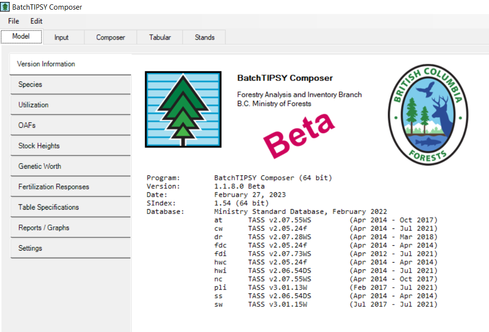

Please not that this is version 1.1.8.0 BETA, February 27, 2023.  

The intent is to have this product ready for general release sometime this spring.  

So for now, use wisely.....

# Model (Intro) Tab Options

The Model tab opens when BTC is instanciated and allows the user to specify a number of options.  In general, the interface has been tailored for TSR use in terms of preset defaults, but it is always good practice to check and see what is turned on and what is turend off.  It may surprise you and we don't want that. 

## Species

Ignore this for now.  This is hard wired.

## Utilization

The default show be set to TSR utilization specifications.  

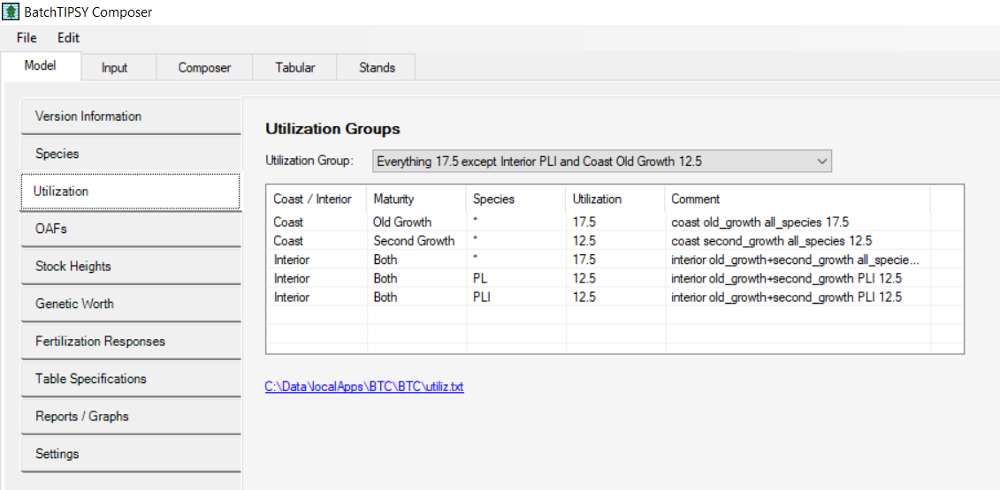

The default should be: Everything 17.5 except Interior Pl and Coast Old Growth 12.5

This can be interpreted as:

- Interior Pl: 12.5
- Interior Other Species: 17.5
- Coast: All species 12.5

- Deciduous Interior : 17.5
- Deciduous Coast: 12.5

## OAFs

BTC has a variety of OAFs that are user selectable:

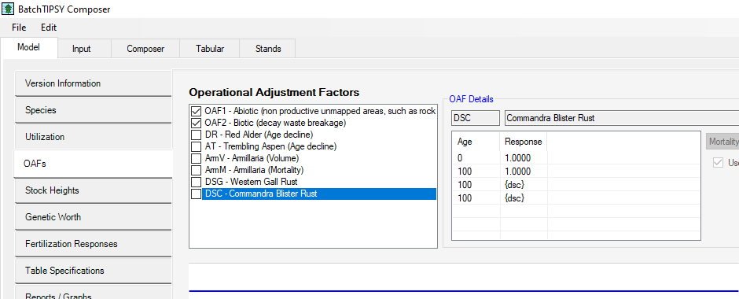

In our case, we will be using the following:

- OAF1
- OAF2
- DR
- AT

The other OAFs:

- AmV
- AmM
- DSG
- CSC

require local information and are not normally used.  

We are using the OAFS provided for Alder (DR) and Aspen (AT).  Note that in the volume output tables, you will notice the decline in deciduous volume.  

### DR OAF

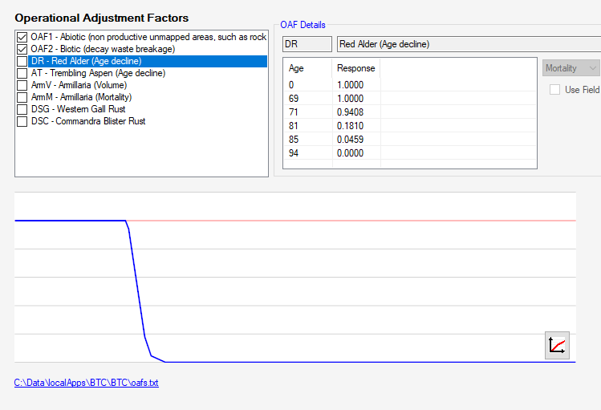

### AT OAF

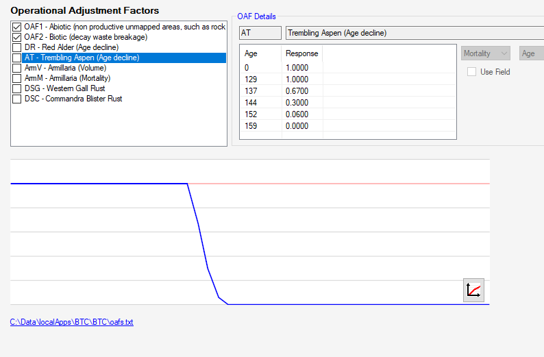

## Stock Height

not used

## Genetic Worth

This is overwritten by the 5 genetic worth columns in the input table.  
(or at least it had better be)

## Fertilizaiton Response

not used

## Table Specifications

BTC tables are capped at age = 120.  This was a group decision that included the Stand Development Modelling group, the YSM group and TSR folk.  

The default setting for BTC should be: 

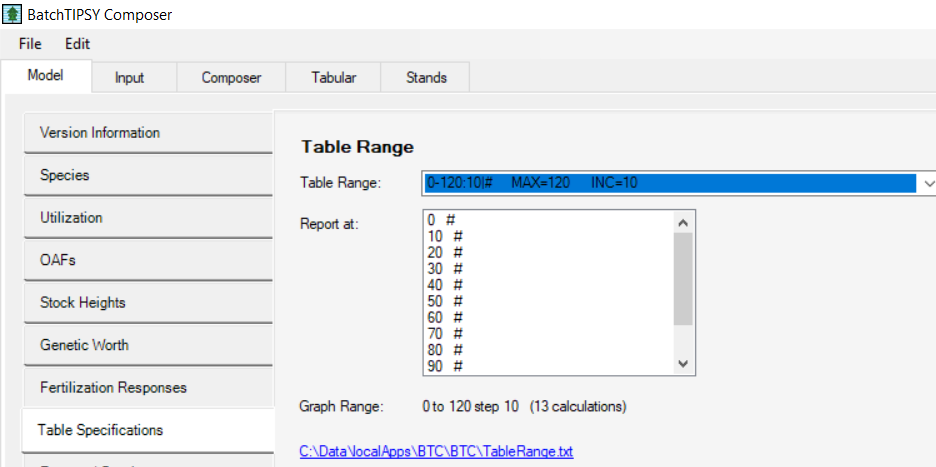

0-120:10|# MAX=120 INC=10

So stands are capped at 120 years and the age incerment is 10.

## Reports / Graphs

ignore

## Settings

ignore

# Input Tab

The next main tab is the Input tab,  This tab allows the user to select the type if format for the input tables.  In the case of TSR, we use a very specific format that is represented in a CSV file.  

## Overview of Input

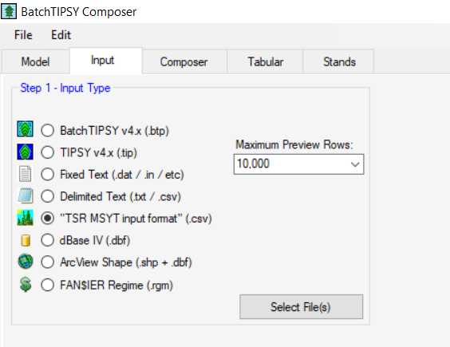

Once you have selected the TSR MSYT input format (csv) you may encounter 2 pop up boxes:

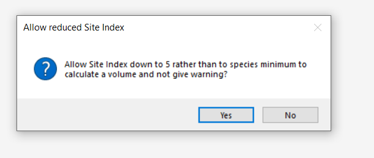

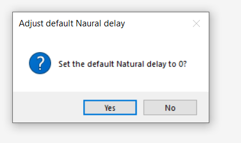

Click yes to both of these.  We are sorting out the defaults for what BTC defines as Natural delay.  

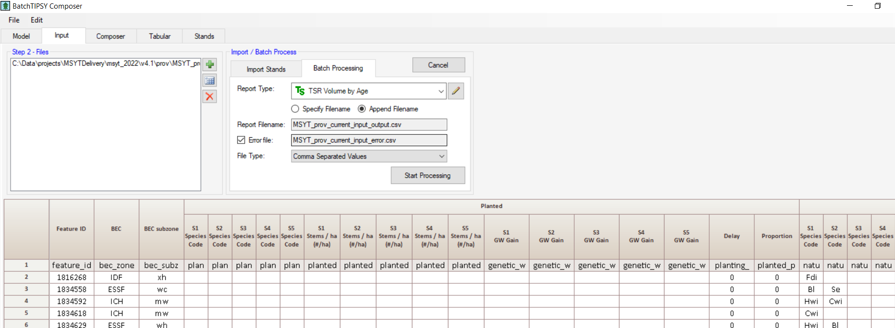

Once you have selected your input file the first few rows will appear.  It is important to note that there are 4 main sections to each input row:

## Identifier Section

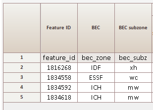

The first section supplies the row identifier (in this case feature_id), as well as the BEC zone and subzone.  
Note that BTC has a know list of BEC and if supplied with something unknown an ERROR will occur.

## Planted Composition

The second section represents the planted component of the stand and shows:

- Planted Species (1-5)
- Planted Species Density (1-5)
- Genetic Worth by species (1-5)
- Planting Delay
- Percent Planted (0-100)

## Natural Composition
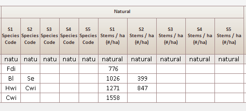

The third section represents the natrual component of the stands and shows:

- Natural Species (1-5)
- Natural Species Density (1-5)

## Other attribution

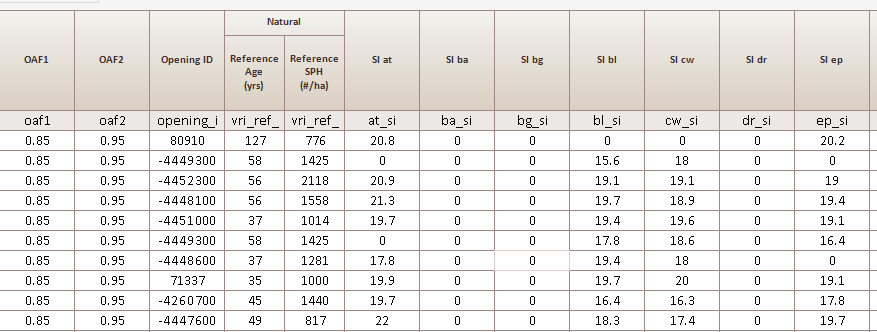

The fourth section shows:

- OAF1
- OAF2
- Opening_id (optional) 

  
  
- vri reference age (for pre 1987 stands)
- vri ref density (for pre 1987 stands)  

 
- Site Index values for all 22 PSPL species

Note that this format differs significantly from previous version of generic TIPSY.  It allows for:

- mixed conifer species
- mixed conifer deciduous species
- mixed planted and natural species (Controlled by planted_percent)

You might ask why we are referencing OAFs in the input when we were asked to tick some OAF boxes at the beginning.  I am asking those questions myself and waiting for an answer.

## The GO Button

Well BTC doesn't actually have button called go, but there is a 

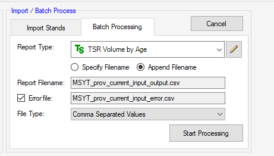

