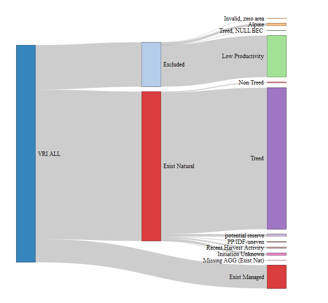
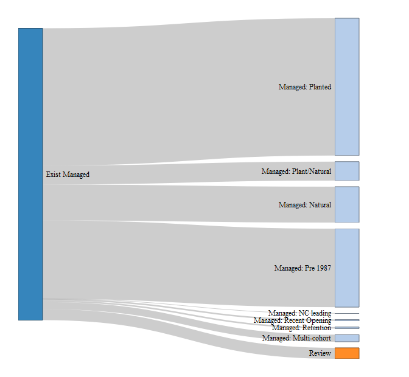

MSYT Report:
============

### Version: msyt\_v3.2 2021.06.07

### Managent Unit: Province TSA 99

------------------------------------------------------------------------

### Classification of VRI features: AR2018

This classification places vri stands (spatial polygons) into distinct
categories for the purpose of assigning current and future yield curves.

**Alpine**: treed but Bec zone BAFA, CMA, IMA or Bec subzone parkland or
Swb with subzone scrub  
**Low Productivity**: treed but VRI site index \< 5 or VRI site index
NULL (Also includes BG grassland types )

**Non Treed**: no harvest date, no opening\_id and no species (also no
non logging distrubance)  
**Treed**: has species, no opening id

**Potential Reserve**: valid opening id but harvest date is NULL  
**PP/IDF-uneven**: ponderosa pine BEC zone PP, IDF uneven management  
**Recent Harvest Activity**: Managed: VRI harvested without a RESULTS
link,opening id = 0 or -99  
**Initiation Unknown**: has a harvest date, but no opening id

**Exist Managed**: has a valid opening id (not equal to 0 or -99)

  Features that are Alpine or are of low productivity can be excluded
from yield consideration.  
Identified here as **Excluded**

The remaining features can be separated into:

**Exist Managed**: those stands that have a direct link to RESULTS
data  
**Exist Natural**: those stands that DO NOT have a direct link to
RESULTS data

 

------------------------------------------------------------------------

 

**Exist Natural** features: current and future yield assignment

<table class="table table-striped" style="font-size: 13px; width: auto !important; ">
<thead>
<tr>
<th style="text-align:right;">
No. Features
</th>
<th style="text-align:left;">
Type
</th>
<th style="text-align:left;">
Current Yield
</th>
<th style="text-align:left;">
Future Yield
</th>
</tr>
</thead>
<tbody>
<tr>
<td style="text-align:right;">
3,167,072
</td>
<td style="text-align:left;">
Treed
</td>
<td style="text-align:left;">
VDYP
</td>
<td style="text-align:left;">
AGGREGATE
</td>
</tr>
<tr>
<td style="text-align:right;">
20,705
</td>
<td style="text-align:left;">
Non Treed (REVIEW)
</td>
<td style="text-align:left;">
VDYP
</td>
<td style="text-align:left;">
AGGREGATE
</td>
</tr>
<tr>
<td style="text-align:right;">
57,528
</td>
<td style="text-align:left;">
potential reserve
</td>
<td style="text-align:left;">
VDYP
</td>
<td style="text-align:left;">
VDYP
</td>
</tr>
<tr>
<td style="text-align:right;">
13,030
</td>
<td style="text-align:left;">
PP/IDF-uneven
</td>
<td style="text-align:left;">
Uneven: VDYP
</td>
<td style="text-align:left;">
Uneven: VDYP
</td>
</tr>
<tr>
<td style="text-align:right;">
31,259
</td>
<td style="text-align:left;">
Recent Harvest Activity
</td>
<td style="text-align:left;">
AGGREGATE
</td>
<td style="text-align:left;">
AGGREGATE
</td>
</tr>
<tr>
<td style="text-align:right;">
54,276
</td>
<td style="text-align:left;">
Initiation Unknown
</td>
<td style="text-align:left;">
VDYP
</td>
<td style="text-align:left;">
AGGREGATE
</td>
</tr>
<tr>
<td style="text-align:right;">
89
</td>
<td style="text-align:left;">
Missing AGG (Exist Nat)
</td>
<td style="text-align:left;">
BEC Substitute
</td>
<td style="text-align:left;">
BEC Substitute
</td>
</tr>
</tbody>
</table>

Note: At the time of analysis, the Consolidated Cut Block layer (CCB) is
used to account for depletions  
not in the VRI at the time it was produced.

This may have the effect of changing the status of some parts of
existing natural stands to recently logged.  
There will be no opening information for these stands and they will thus
use an AGGREGATE curve.

Under certain conditions, the CCB may bring in older data that defines a
harvest date prior to 1987.  
For these stands, a Natural Aggregate will be used.

### Exist Natural: To be reviewed

#### Low Productivity

Stands in this classification have a VRI site index \< 5 OR a VRI site
index NULL. In older data VRI, there was a time when newly harvested
stands had the VRI siteindex set to NULL, but this is not consistenlty
applied. Where CCB indicates something other than a low productivity
stand, the analyst will have to choose between a VDYP curve (if
available), use of a BEC AGGREGATE (the curve will have to be generated
and site index values supplied) or some other appropriate method.

#### Non Treed

Stands in this classification have a VRI site index \> 5. They have no
indication of species and in terms of land classification they can be a
variety of shrubs, herbaceous or non vegetated land.

Since these were seen as “non forested” in the PSPL process, they do not
have a PSPL site index derived.

These stands need to be REVIEWED to determine if they have actually been
logged. Until further information is provided, a BEC based aggregate is
used as the default.

Outcomes: The stands that were logged need to be FIXED in vri. These
types of stands should be included in PSPL processing.

#### Missing AGG (Exist Nat)

Any stands in this category do not have a matching BEC aggregate.  
They will need a BEC substitution and the generation of a new yield
table.

 

------------------------------------------------------------------------

### Exist Managed

**Managed: Planted**: no Natural composition  
**Managed: Plant/Natural**: less than 90% planted based on NAR  
**Managed: Natural**: no planting data  
**Managed: Pre 1987**: Stands harvested prior to 1987.

**Managed: NC Leading**: Non commercial as leading species  
**Managed: Recent Opening**: no Planting or FC info  
**Managed: Retention**: evidence of retained stand covering the entire
opening  
**Managed: Multi-cohort**: evidence of a multi layered (complex) stand

**Review**: stand tagged for analyst review due to incomplete data

 

------------------------------------------------------------------------

 

**Exist Managed**: current and future Yield Assignment

<table class="table table-striped" style="font-size: 13px; width: auto !important; ">
<thead>
<tr>
<th style="text-align:left;">
No. Features
</th>
<th style="text-align:left;">
Type
</th>
<th style="text-align:left;">
Current Yield
</th>
<th style="text-align:left;">
Future Yield
</th>
</tr>
</thead>
<tbody>
<tr>
<td style="text-align:left;">
245557
</td>
<td style="text-align:left;">
Managed: Planted
</td>
<td style="text-align:left;">
Managed: Planted
</td>
<td style="text-align:left;">
Managed: Planted
</td>
</tr>
<tr>
<td style="text-align:left;">
64239
</td>
<td style="text-align:left;">
Managed: Natural
</td>
<td style="text-align:left;">
Managed: Natural
</td>
<td style="text-align:left;">
Managed: Natural
</td>
</tr>
<tr>
<td style="text-align:left;">
33924
</td>
<td style="text-align:left;">
Managed: Plant/Natural
</td>
<td style="text-align:left;">
Managed: Planted/Natural
</td>
<td style="text-align:left;">
Managed: Planted/Natural
</td>
</tr>
<tr>
<td style="text-align:left;">
140339
</td>
<td style="text-align:left;">
Managed: Pre 1987
</td>
<td style="text-align:left;">
Managed: VRI-NAT
</td>
<td style="text-align:left;">
AGGREGATE
</td>
</tr>
<tr>
<td style="text-align:left;">
220
</td>
<td style="text-align:left;">
Managed: NC leading
</td>
<td style="text-align:left;">
Managed: NC leading
</td>
<td style="text-align:left;">
Managed: NC leading
</td>
</tr>
<tr>
<td style="text-align:left;">
</td>
<td style="text-align:left;">
</td>
<td style="text-align:left;">
</td>
<td style="text-align:left;">
</td>
</tr>
<tr>
<td style="text-align:left;">
2704
</td>
<td style="text-align:left;">
Managed: Recent Opening
</td>
<td style="text-align:left;">
AGGREGATE
</td>
<td style="text-align:left;">
AGGREGATE
</td>
</tr>
<tr>
<td style="text-align:left;">
12687
</td>
<td style="text-align:left;">
Managed: Multi-cohort
</td>
<td style="text-align:left;">
VDYP
</td>
<td style="text-align:left;">
VDYP
</td>
</tr>
<tr>
<td style="text-align:left;">
2742
</td>
<td style="text-align:left;">
Managed: Retention
</td>
<td style="text-align:left;">
VDYP
</td>
<td style="text-align:left;">
VDYP
</td>
</tr>
<tr>
<td style="text-align:left;">
19591
</td>
<td style="text-align:left;">
Review
</td>
<td style="text-align:left;">
Natural AGGREGATE(\*)
</td>
<td style="text-align:left;">
AGGREGATE
</td>
</tr>
</tbody>
</table>

Note: Stands harvested prior to 1987 uses a VRI derived natural species
composition in TIPSY.  
They are treated as a managed stand. Since this is a new process and
utilzes a backgrow feature in TIPSY,  
these yields should be checked by the analyst.

<table class="table table-striped" style="font-size: 13px; width: auto !important; ">
<thead>
<tr>
<th style="text-align:left;">
No. Features
</th>
<th style="text-align:left;">
Type
</th>
<th style="text-align:left;">
Yield Type
</th>
<th style="text-align:left;">
category
</th>
</tr>
</thead>
<tbody>
<tr>
<td style="text-align:left;">
245557
</td>
<td style="text-align:left;">
Managed: Planted
</td>
<td style="text-align:left;">
M:M
</td>
<td style="text-align:left;">
managed
</td>
</tr>
<tr>
<td style="text-align:left;">
64239
</td>
<td style="text-align:left;">
Managed: Natural
</td>
<td style="text-align:left;">
M:M
</td>
<td style="text-align:left;">
managed
</td>
</tr>
<tr>
<td style="text-align:left;">
33924
</td>
<td style="text-align:left;">
Managed: Plant/Natural
</td>
<td style="text-align:left;">
M:M
</td>
<td style="text-align:left;">
managed
</td>
</tr>
<tr>
<td style="text-align:left;">
140339
</td>
<td style="text-align:left;">
Managed: Pre 1987
</td>
<td style="text-align:left;">
MNVRI:A
</td>
<td style="text-align:left;">
managed
</td>
</tr>
<tr>
<td style="text-align:left;">
220
</td>
<td style="text-align:left;">
Managed: NC leading
</td>
<td style="text-align:left;">
M:M
</td>
<td style="text-align:left;">
managed
</td>
</tr>
<tr>
<td style="text-align:left;">
</td>
<td style="text-align:left;">
</td>
<td style="text-align:left;">
</td>
<td style="text-align:left;">
</td>
</tr>
<tr>
<td style="text-align:left;">
2704
</td>
<td style="text-align:left;">
Managed: Recent Opening
</td>
<td style="text-align:left;">
A:A
</td>
<td style="text-align:left;">
aggregate
</td>
</tr>
<tr>
<td style="text-align:left;">
12687
</td>
<td style="text-align:left;">
Managed: Multi-cohort
</td>
<td style="text-align:left;">
V:V
</td>
<td style="text-align:left;">
VDYP
</td>
</tr>
<tr>
<td style="text-align:left;">
2742
</td>
<td style="text-align:left;">
Managed: Retention
</td>
<td style="text-align:left;">
V:V
</td>
<td style="text-align:left;">
VDYP
</td>
</tr>
<tr>
<td style="text-align:left;">
8
</td>
<td style="text-align:left;">
Missing AGG (Managed)
</td>
<td style="text-align:left;">
BECA:BECA
</td>
<td style="text-align:left;">
</td>
</tr>
</tbody>
</table>

Stands tagged for review in general use a Natural Aggregate. See the
following table for details.

 

------------------------------------------------------------------------

 

Features that need to be Reviewed:

<table class="table table-striped" style="font-size: 13px; width: auto !important; ">
<thead>
<tr>
<th style="text-align:right;">
No. Features
</th>
<th style="text-align:left;">
Stand Type
</th>
<th style="text-align:left;">
Current Yield
</th>
<th style="text-align:left;">
Future Yield
</th>
</tr>
</thead>
<tbody>
<tr>
<td style="text-align:right;">
417
</td>
<td style="text-align:left;">
Managed Review: FC incomplete, Partially planted
</td>
<td style="text-align:left;">
Natural Aggregate
</td>
<td style="text-align:left;">
AGGREGATE
</td>
</tr>
<tr>
<td style="text-align:right;">
31
</td>
<td style="text-align:left;">
Managed Review: FC incomplete, Planted invalid density
</td>
<td style="text-align:left;">
Natural Aggregate
</td>
<td style="text-align:left;">
AGGREGATE
</td>
</tr>
<tr>
<td style="text-align:right;">
3,589
</td>
<td style="text-align:left;">
Managed Review: FC valid data, Planted invalid density
</td>
<td style="text-align:left;">
Natural Aggregate
</td>
<td style="text-align:left;">
AGGREGATE
</td>
</tr>
<tr>
<td style="text-align:right;">
1
</td>
<td style="text-align:left;">
Managed Review: FC Nc leading, Planted invalid density or planted \< 10%
</td>
<td style="text-align:left;">
Natural Aggregate
</td>
<td style="text-align:left;">
AGGREGATE
</td>
</tr>
<tr>
<td style="text-align:right;">
9,099
</td>
<td style="text-align:left;">
Managed Review: Not yet stocked
</td>
<td style="text-align:left;">
Natural Aggregate
</td>
<td style="text-align:left;">
AGGREGATE
</td>
</tr>
<tr>
<td style="text-align:right;">
517
</td>
<td style="text-align:left;">
Managed Review: FC incomplete - not planted
</td>
<td style="text-align:left;">
Natural Aggregate
</td>
<td style="text-align:left;">
AGGREGATE
</td>
</tr>
<tr>
<td style="text-align:right;">
50
</td>
<td style="text-align:left;">
Managed Review: FC incomplete - plant \< 10%
</td>
<td style="text-align:left;">
Natural Aggregate
</td>
<td style="text-align:left;">
AGGREGATE
</td>
</tr>
<tr>
<td style="text-align:right;">
56
</td>
<td style="text-align:left;">
Managed Review: FC low denisty, NOT planted
</td>
<td style="text-align:left;">
Natural Aggregate
</td>
<td style="text-align:left;">
AGGREGATE
</td>
</tr>
<tr>
<td style="text-align:right;">
434
</td>
<td style="text-align:left;">
Managed Review: FC Non Productive
</td>
<td style="text-align:left;">
Natural Aggregate
</td>
<td style="text-align:left;">
AGGREGATE
</td>
</tr>
<tr>
<td style="text-align:right;">
5,389
</td>
<td style="text-align:left;">
Managed Review: Pre 1987, incomplete
</td>
<td style="text-align:left;">
VDYP
</td>
<td style="text-align:left;">
AGGREGATE
</td>
</tr>
<tr>
<td style="text-align:right;">
8
</td>
<td style="text-align:left;">
Missing AGG (Managed)
</td>
<td style="text-align:left;">
BEC Substitute
</td>
<td style="text-align:left;">
BEC Substitute
</td>
</tr>
</tbody>
</table>

**Review**: Total : 19591

These stands will use a natural AGGREGATE UNLESS corrected at the review
period.

**Notes:**

Stands harvested prior to 1987 with incomplete VRI data are a special
case. Unless corrected, these stands will use VDYP curve for current
yield. In addition, there are cases where the VRI reference age
conflicts with either the RESULTS harvest year or the VRI harvest year.
These stands are placed in this category for the analyst to review.

Not yet stocked is a special category that requires review. These stands
are suspect to either bad data or incomplete stocking. In either case,
these should be verified before assigned a yield.

Stands tagged as Missing AGG (Managed) do not have a BEC derived
AGGREGATE. They will require a BEC crosswalk table.

 

------------------------------------------------------------------------

 

**Species composition** for Existing Managed stands comes from Planting
data from RESULTS.  
This is augmented with Natural composition using total stems from INV
survey data.  
Species composition is adjusted by combining the two sets of data, thus
allowing for changes in species composition from the time of planting
until the time of survey.

**Site index** for managed stands is assigned at the opening id or
feature id using the Provincial Site Productivity Layer (PSPL).  
Where PSPL site index doesn’t exist, a BEC zone/subzone average will be
used.

 

------------------------------------------------------------------------

 

**Yield Model**

Yield curves are produced using BatchTIPSY Composer (1.0.14.0 Beta,
March 25, 2021)  
SIndex: 1.53  
Tipsy: 4.4

 

------------------------------------------------------------------------

 

**BEC substitutions**

In the derivation of BEC zone subzone aggregates, some combinations that
have a valid opening id DO NOT have an aggregate.

The aggregates are derived using what is considered current silviculture
practices. In this context, planting data from 2005 to 2015 is used. The
latest 5 years of planting data are excluded because planting is not
always initiated right after harvest.

This technique may cause some BEC zone subzones to not appear in the
aggregate data and in these cases a BEC substitute is required. The
following substitutions are used:

<table class="table table-striped" style="font-size: 13px; width: auto !important; ">
<thead>
<tr>
<th style="text-align:left;">
Missing BEC
</th>
<th style="text-align:left;">
Substition
</th>
</tr>
</thead>
<tbody>
<tr>
<td style="text-align:left;">
BWBSvk
</td>
<td style="text-align:left;">
BWBSwk
</td>
</tr>
<tr>
<td style="text-align:left;">
CWHwm
</td>
<td style="text-align:left;">
CWHvm
</td>
</tr>
<tr>
<td style="text-align:left;">
ESSFdvw
</td>
<td style="text-align:left;">
ESSFdv
</td>
</tr>
<tr>
<td style="text-align:left;">
ESSFmvp
</td>
<td style="text-align:left;">
ESSFmv
</td>
</tr>
<tr>
<td style="text-align:left;">
ESSFmww
</td>
<td style="text-align:left;">
ESSFmw
</td>
</tr>
<tr>
<td style="text-align:left;">
ESSFmz
</td>
<td style="text-align:left;">
ESSFun
</td>
</tr>
<tr>
<td style="text-align:left;">
ESSFwcp
</td>
<td style="text-align:left;">
ESSFwc
</td>
</tr>
<tr>
<td style="text-align:left;">
MHun
</td>
<td style="text-align:left;">
MHmm
</td>
</tr>
<tr>
<td style="text-align:left;">
MSdv
</td>
<td style="text-align:left;">
MSxv
</td>
</tr>
<tr>
<td style="text-align:left;">
SBSmv
</td>
<td style="text-align:left;">
SBSun
</td>
</tr>
<tr>
<td style="text-align:left;">
SWBmk
</td>
<td style="text-align:left;">
BWBSdk
</td>
</tr>
<tr>
<td style="text-align:left;">
SWBmks
</td>
<td style="text-align:left;">
BWBSdk
</td>
</tr>
<tr>
<td style="text-align:left;">
SWBun
</td>
<td style="text-align:left;">
BWBSdk
</td>
</tr>
<tr>
<td style="text-align:left;">
SWBvk
</td>
<td style="text-align:left;">
BWBSdk
</td>
</tr>
</tbody>
</table>

 

------------------------------------------------------------------------

 

**Planting History (2005-2015)**  
Province

<table class="table table-striped" style="font-size: 13px; width: auto !important; ">
<thead>
<tr>
<th style="text-align:left;">
tsa\_no
</th>
<th style="text-align:right;">
percent\_planted
</th>
<th style="text-align:right;">
percent\_natural
</th>
</tr>
</thead>
<tbody>
<tr>
<td style="text-align:left;">
prov
</td>
<td style="text-align:right;">
80
</td>
<td style="text-align:right;">
20
</td>
</tr>
</tbody>
</table>

 

------------------------------------------------------------------------

 

Check for missing BEC AGGREGATES for managed stands

<table class="table table-striped" style="font-size: 12px; width: auto !important; ">
<caption style="font-size: initial !important;">
Table 1.
</caption>
<thead>
<tr>
<th style="text-align:right;">
count
</th>
<th style="text-align:left;">
bec\_zone
</th>
<th style="text-align:left;">
bec\_subzone
</th>
</tr>
</thead>
<tbody>
<tr>
<td style="text-align:right;">
1
</td>
<td style="text-align:left;">
CMA
</td>
<td style="text-align:left;">
unp
</td>
</tr>
<tr>
<td style="text-align:right;">
6
</td>
<td style="text-align:left;">
ESSF
</td>
<td style="text-align:left;">
dkp
</td>
</tr>
<tr>
<td style="text-align:right;">
1
</td>
<td style="text-align:left;">
SWB
</td>
<td style="text-align:left;">
uns
</td>
</tr>
</tbody>
</table>

 

------------------------------------------------------------------------

 

Check for missing BEC AGGREGATES for exist natural stands

<table class="table table-striped" style="font-size: 12px; width: auto !important; ">
<caption style="font-size: initial !important;">
Table 2.
</caption>
<thead>
<tr>
<th style="text-align:right;">
count
</th>
<th style="text-align:left;">
bec\_zone
</th>
<th style="text-align:left;">
bec\_subzone
</th>
</tr>
</thead>
<tbody>
<tr>
<td style="text-align:right;">
32
</td>
<td style="text-align:left;">
BG
</td>
<td style="text-align:left;">
xh
</td>
</tr>
<tr>
<td style="text-align:right;">
3
</td>
<td style="text-align:left;">
BG
</td>
<td style="text-align:left;">
xw
</td>
</tr>
<tr>
<td style="text-align:right;">
4
</td>
<td style="text-align:left;">
CMA
</td>
<td style="text-align:left;">
unp
</td>
</tr>
<tr>
<td style="text-align:right;">
32
</td>
<td style="text-align:left;">
CWH
</td>
<td style="text-align:left;">
un
</td>
</tr>
<tr>
<td style="text-align:right;">
18
</td>
<td style="text-align:left;">
MS
</td>
<td style="text-align:left;">
un
</td>
</tr>
</tbody>
</table>

 

------------------------------------------------------------------------

 

**Stand age derived from RESULTS**:

In addition to a set of MSYTs, a stand age is dervied from RESULTS for
those stands that are currently managed. This age is intended for use in
timber supply modelling. The age is supplied in the refence table that
is delivered along with the MSYTs. The column name is : rslt\_age

rslt\_age is derived in the following manner:

rlst\_age = (analysis ready data year) - establishment date. Note that
for AR2018 data the year is set to 2018.

establishment date is the earliest of (harvest date or disturbance date)

Note that some stands are not tagged with a harvest date, but are tagged
with a disturbance date. If harvest date is missing, the disturbance
date is used.

The harvest date (or disturbance date) is assigned based on the earliest
harvest (or disturbance) for the largest treatment area within an
opening.

 

------------------------------------------------------------------------
